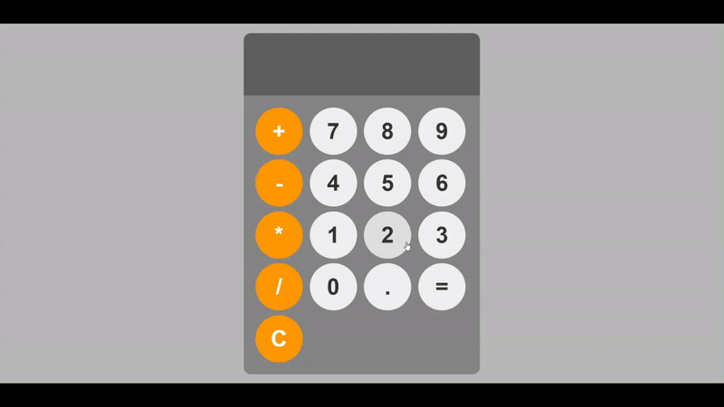

# 🧮 Calculator Program

A modern and interactive calculator application built with HTML, CSS, and JavaScript!



## 📝 Description

This is a fully functional calculator program that allows users to:

- ➕ **Add** numbers with smooth operation
- ➖ **Subtract** numbers with precision
- ✖️ **Multiply** numbers efficiently
- ➗ **Divide** numbers with zero-division protection
- 🔢 **Decimal** point calculations
- 🧹 **Clear** display and reset operations
- ⌨️ **Keyboard** input support

The calculator features a beautiful glassmorphism design with a translucent background, gradient buttons, and smooth animations. It includes error handling and responsive design for optimal user experience across all devices.

## 🚀 Features

- 🎯 **Intuitive Interface**: Modern glassmorphism design with clean layout
- 🎨 **Interactive Buttons**: Smooth hover effects and ripple animations
- 💫 **Visual Feedback**: Button press animations and smooth transitions
- ⌨️ **Keyboard Support**: Full keyboard navigation and input
- 🛡️ **Error Handling**: Division by zero protection and input validation
- 📱 **Responsive Design**: Optimized for desktop and mobile devices
- 🌙 **Dark Mode**: Automatic dark mode support
- ♿ **Accessibility**: ARIA labels and semantic HTML structure

## 🛠️ Technologies Used

- **HTML5**: Semantic structure and accessibility features
- **CSS3**: Modern styling with glassmorphism, gradients, and animations
- **JavaScript ES6**: Interactive functionality and event handling

## 📁 Project Structure

```
Calculator program/
├── index.html      # Main HTML structure
├── style.css       # Modern CSS styling with animations
├── index.js        # JavaScript calculator logic
├── demo.gif        # Demo animation
└── README.md       # Project documentation
```

## 🎮 How to Use

### Mouse Controls:

1. Open `index.html` in your web browser
2. Click number buttons (0-9) to input numbers
3. Click operator buttons (+, -, ×, ÷) for calculations
4. Click the **"="** button or press Enter to get results
5. Click the **"C"** button to clear and reset

### Keyboard Controls:

- **Numbers (0-9)**: Input digits
- **Operators (+, -, \*, /)**: Mathematical operations
- **Enter or =**: Calculate result
- **Escape or C**: Clear display
- **Backspace**: Delete last digit
- **. (period)**: Add decimal point

## ✨ Advanced Features

- **Continuous Calculations**: Chain operations without clearing
- **Floating Point Precision**: Handles decimal calculations accurately
- **Visual Operation Feedback**: Shows current operator briefly
- **Auto-formatting**: Prevents multiple decimals and handles edge cases
- **Exponential Notation**: For very large numbers
- **Memory Management**: Efficient state management for complex operations

## 🎓 Learning Source

This project was created as part of learning JavaScript from:

**🌐 JavaScript Full Course for free (2024)** by **Bro Code**

📺 [Watch the tutorial here](https://www.youtube.com/watch?v=lfmg-EJ8gm4)

## 💡 What I Learned

- Advanced DOM manipulation with JavaScript
- Event handling with both mouse and keyboard events
- CSS Grid layout for responsive button arrangement
- Modern CSS techniques (glassmorphism, gradients, animations)
- Error handling and input validation
- State management in JavaScript applications
- Accessibility best practices with ARIA labels
- Responsive design principles
- CSS custom properties and animations

## 🎨 Design Features

- **Glassmorphism Effect**: Translucent background with backdrop blur
- **Gradient Backgrounds**: Beautiful color transitions
- **Smooth Animations**: Hover effects and button interactions
- **Ripple Effects**: Visual feedback on button press
- **Modern Typography**: Clean, readable fonts
- **Color Coding**: Different colors for different button types

## 🔧 Technical Highlights

- **Modular JavaScript**: Well-structured, maintainable code
- **CSS Grid**: Flexible button layout system
- **Event Delegation**: Efficient event handling
- **State Management**: Proper calculator state handling
- **Error Prevention**: Input validation and edge case handling

---

⭐ **Happy Calculating!** ⭐
