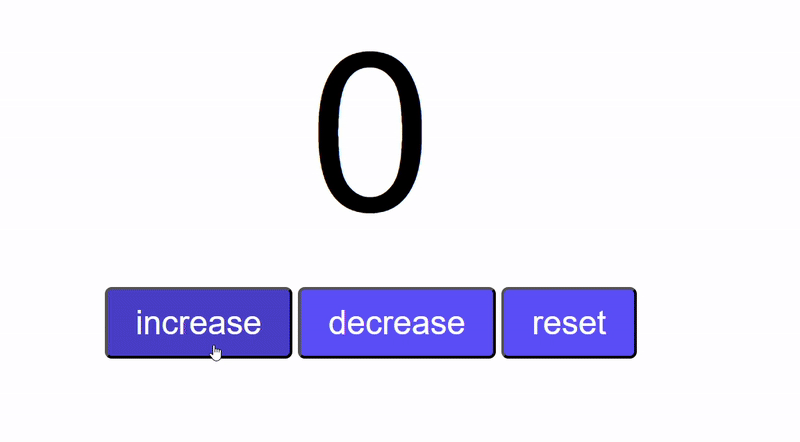

# 🔢 Counter Program

A simple and interactive counter application built with HTML, CSS, and JavaScript!



## 📝 Description

This is a basic counter program that allows users to:

- ➕ **Increase** the counter value
- ➖ **Decrease** the counter value
- 🔄 **Reset** the counter back to zero

The counter displays a large number in the center of the screen with three interactive buttons below it. The interface features a clean, modern design with hover effects for better user experience.

## 🚀 Features

- 🎯 **Simple Interface**: Clean and intuitive design
- 🎨 **Responsive Buttons**: Interactive buttons with hover effects
- 💫 **Smooth Transitions**: CSS transitions for better UX
- 📱 **Cross-browser Compatible**: Works on all modern browsers

## 🛠️ Technologies Used

- **HTML5**: Structure and layout
- **CSS3**: Styling and animations
- **JavaScript**: Interactive functionality

## 📁 Project Structure

```
CounterProgram/
├── index.html      # Main HTML file
├── style.css       # CSS styling
├── script.js       # JavaScript functionality
├── demo.gif        # Demo animation
└── readme.md       # Project documentation
```

## 🎮 How to Use

1. Open `index.html` in your web browser
2. Click the **"increase"** button to add 1 to the counter
3. Click the **"decrease"** button to subtract 1 from the counter
4. Click the **"reset"** button to set the counter back to 0

## 🎓 Learning Source

This project was created as part of learning JavaScript from:

**🌐 JavaScript Full Course for free (2024)** by **Bro Code**

📺 [Watch the tutorial here](https://www.youtube.com/watch?v=lfmg-EJ8gm4)

## 💡 What I Learned

- DOM manipulation with JavaScript
- Event handling with onclick events
- Variable management in JavaScript

---

⭐ **Happy Coding!** ⭐
