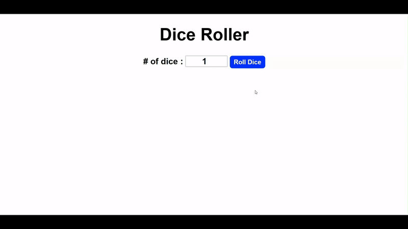

# 🎲 Dice Roller Program

A fun and interactive dice rolling application built with HTML, CSS, and JavaScript!



## 📝 Description

This is a dynamic dice roller program that allows users to:

- 🎲 **Roll Multiple Dice**: Choose how many dice to roll (1 or more)
- 🔢 **View Results**: See the numerical values of each dice roll
- 🖼️ **Visual Display**: Watch animated dice images showing the results
- 🎯 **Customizable**: Set any number of dice you want to roll

The application features a clean interface where users can specify the number of dice, click the roll button, and see both the numerical results and visual dice images displaying the outcome of each roll.

## 🚀 Features

- 🎯 **Simple Interface**: Clean and intuitive design
- 🎲 **Multiple Dice Rolling**: Roll 1 to unlimited dice at once
- 🖼️ **Visual Dice Images**: Beautiful dice images for each result
- 🎨 **Interactive Buttons**: Hover effects and smooth animations
- 📱 **Responsive Design**: Works perfectly on all screen sizes
- ⚡ **Real-time Results**: Instant dice rolling with random outcomes

## 🛠️ Technologies Used

- **HTML5**: Structure and layout
- **CSS3**: Styling, animations, and responsive design
- **JavaScript**: Random number generation and DOM manipulation

## 📁 Project Structure

```
Dice Roller Program/
├── index.html          # Main HTML file
├── styles.css          # CSS styling
├── index.js           # JavaScript functionality
├── demo.gif           # Demo animation
├── dices/             # Dice images folder
│   ├── 1.png          # Dice face 1
│   ├── 2.png          # Dice face 2
│   ├── 3.png          # Dice face 3
│   ├── 4.png          # Dice face 4
│   ├── 5.png          # Dice face 5
│   └── 6.png          # Dice face 6
└── README.md          # Project documentation
```

## 🎮 How to Use

1. Open `index.html` in your web browser
2. Enter the **number of dice** you want to roll in the input field
3. Click the **"Roll Dice"** button to roll the dice
4. View the **numerical results** displayed below the button
5. See the **visual dice images** showing each dice face rolled

## 🎲 How It Works

1. **Input Validation**: User specifies number of dice (minimum 1)
2. **Random Generation**: JavaScript generates random numbers between 1-6 for each dice
3. **Visual Display**: Corresponding dice images are displayed for each result
4. **Result Summary**: All dice values are shown in a readable format

## 🎓 Learning Source

This project was created as part of learning JavaScript from:

**🌐 JavaScript Full Course for free (2024)** by **Bro Code**

📺 [Watch the tutorial here](https://www.youtube.com/watch?v=lfmg-EJ8gm4)

## 💡 What I Learned

- 🎯 **DOM Manipulation**: Working with `getElementById()` and element properties
- 🔄 **Loops and Arrays**: Using for loops and array methods like `push()` and `join()`
- 🎲 **Random Number Generation**: Using `Math.random()` and `Math.floor()` for dice simulation
- 🖼️ **Dynamic Image Display**: Creating and displaying images dynamically with JavaScript
- 📝 **Input Handling**: Reading and processing user input from HTML forms
- 🎨 **Event Handling**: Implementing onclick events for interactive buttons

---

⭐ **Happy Rolling!** ⭐
