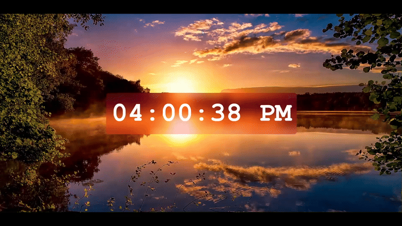

# 🕐 Digital Clock Program

A beautiful and functional digital clock application built with HTML, CSS, and JavaScript!



## 📝 Description

This is a real-time digital clock program that displays:

- 🕐 **Current Time** in 12-hour format
- 🌅 **AM/PM indicator** for time of day
- ⏰ **Live Updates** every second
- 🎨 **Clean Interface** with modern styling

The clock automatically updates every second and shows the current time in a user-friendly HH:MM:SS format with proper AM/PM notation.

## 🚀 Features

- 🎯 **Real-time Display**: Updates every second automatically
- 🕐 **12-hour Format**: Easy-to-read time format with AM/PM
- 📱 **Responsive Design**: Works perfectly on all screen sizes
- 🎨 **Modern Styling**: Clean and elegant appearance
- ⚡ **Lightweight**: Fast loading and efficient performance

## 🛠️ Technologies Used

- **HTML5**: Structure and layout
- **CSS3**: Styling and visual design
- **JavaScript**: Real-time functionality and DOM manipulation

## 📁 Project Structure

```
Digital Clock Program/
├── index.html      # Main HTML file
├── style.css       # CSS styling
├── script.js       # JavaScript functionality
├── demo.gif        # Demo animation
├── img.jpg         # Project image
└── README.md       # Project documentation
```

## 🎮 How to Use

1. Open `index.html` in your web browser
2. The clock will automatically start displaying the current time
3. Watch as it updates every second in real-time
4. The display shows time in 12-hour format with AM/PM indicator

## 🎓 Learning Source

This project was created as part of learning JavaScript from:

**🌐 JavaScript Full Course for free (2024)** by **Bro Code**

📺 [Watch the tutorial here](https://www.youtube.com/watch?v=lfmg-EJ8gm4)

## 💡 What I Learned

- Working with JavaScript Date objects
- DOM manipulation and element selection
- Using setInterval() for continuous updates
- String manipulation with padStart() method
- Converting between 12-hour and 24-hour time formats
- Conditional operators (ternary operator)

## 🔧 Key JavaScript Concepts

- `new Date()` - Creating date objects
- `setInterval()` - Executing functions repeatedly
- `getElementById()` - DOM element selection
- `padStart()` - String formatting
- Modulo operator (%) for time conversion

---

⭐ **Happy Coding!** ⭐
