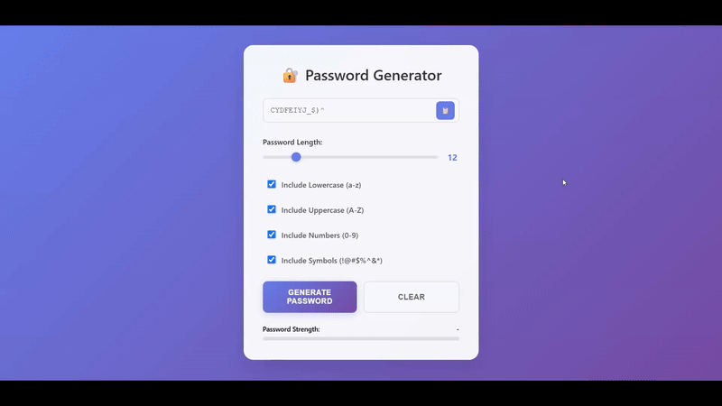

# 🔐 Random Password Generator

A secure and customizable password generator application built with HTML, CSS, and JavaScript!



## 📝 Description

This is a powerful password generator that allows users to:

- 🔢 **Customize Length**: Set password length from 4 to 50 characters
- 🔤 **Choose Character Types**: Include/exclude lowercase, uppercase, numbers, and symbols
- 🎲 **Generate Secure Passwords**: Create random, cryptographically secure passwords
- 📋 **Copy to Clipboard**: One-click copy functionality
- 🧹 **Clear Passwords**: Reset the password field instantly

The generator features a modern, glass-morphism design with real-time password strength indicators and smooth animations for an excellent user experience.

## 🚀 Features

- 🎯 **Intuitive Interface**: Clean and user-friendly design
- 🎨 **Glass-morphism Design**: Modern UI with backdrop blur effects
- 🔒 **Password Strength Indicator**: Real-time strength analysis with color-coded progress bar
- 📱 **Fully Responsive**: Works perfectly on desktop, tablet, and mobile devices
- 🎛️ **Interactive Controls**: Range slider for length and checkboxes for character types
- 💫 **Smooth Animations**: CSS transitions and hover effects
- 🔔 **Copy Notifications**: Visual feedback when password is copied
- ⚡ **Auto-Generation**: Automatically updates password when settings change

## 🛠️ Technologies Used

- **HTML5**: Structure and semantic markup
- **CSS3**: Advanced styling with gradients, backdrop-filter, and animations
- **JavaScript**: Password generation logic and DOM manipulation

## 📁 Project Structure

```
Random password generator/
├── index.html      # Main HTML file with form elements
├── style.css       # CSS styling with modern design
├── script.js       # JavaScript password generation logic
└── README.md       # Project documentation
```

## 🎮 How to Use

1. Open `index.html` in your web browser
2. Adjust the **password length** using the slider (4-50 characters)
3. Select desired **character types** using checkboxes:
   - Lowercase letters (a-z)
   - Uppercase letters (A-Z)
   - Numbers (0-9)
   - Special symbols (!@#$%^&\*)
4. Click **"Generate Password"** to create a new password
5. Use the **copy button** (📋) to copy password to clipboard
6. Click **"Clear"** to reset the password field

## 🎓 Learning Source

This project was created as part of learning JavaScript from:

**🌐 JavaScript Full Course for free (2024)** by **Bro Code**

📺 [Watch the tutorial here](https://www.youtube.com/watch?v=lfmg-EJ8gm4)

## 💡 What I Learned

- JavaScript function parameters and return values
- String manipulation and concatenation
- Math.random() for cryptographic randomness
- DOM manipulation and event handling
- Form validation and error handling
- CSS Grid and Flexbox layouts
- Modern CSS features (backdrop-filter, custom properties)
- Responsive web design principles
- Clipboard API for copy functionality

## 🔧 Core Algorithm

The password generation uses a character pool approach:

1. Build allowed character sets based on user selection
2. Validate input parameters (length > 0, at least one character type)
3. Use Math.random() to select random characters from the pool
4. Assemble final password string

## 🌟 Future Enhancements

- 💾 Save password history
- 🎨 Theme customization
- 📊 Advanced password analysis
- 🔄 Bulk password generation
- 💼 Export passwords to file

---

⭐ **Stay Secure! Generate Strong Passwords!** ⭐
