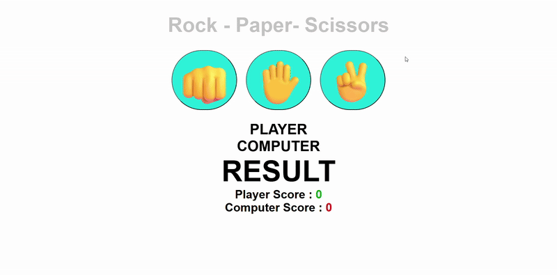

# ✂️ Rock Paper Scissors Game

A fun and interactive Rock Paper Scissors game built with HTML, CSS, and JavaScript!



## 📝 Description

This is a classic Rock Paper Scissors game where you can play against the computer. The game features:

- 👊 **Rock** beats Scissors
- ✋ **Paper** beats Rock
- ✌️ **Scissors** beats Paper

Choose your move by clicking one of the emoji buttons, and watch as the computer makes its choice. The game keeps track of both player and computer scores, with dynamic color changes to show win/lose results!

## 🚀 Features

- 🎯 **Interactive Gameplay**: Click emoji buttons to make your choice
- 🤖 **AI Opponent**: Computer makes random choices for fair gameplay
- 📊 **Score Tracking**: Real-time score updates for both player and computer
- 🎨 **Visual Feedback**: Green text for wins, red text for losses
- 🎭 **Emoji Interface**: Fun rock 👊, paper ✋, and scissors ✌️ buttons
- 💫 **Smooth Animations**: CSS hover effects and transitions
- 📱 **Responsive Design**: Works perfectly on all devices

## 🛠️ Technologies Used

- **HTML5**: Structure and layout
- **CSS3**: Styling, animations, and responsive design
- **JavaScript**: Game logic, DOM manipulation, and event handling

## 📁 Project Structure

```
Rock Paper Scissors/
├── index.html      # Main HTML file
├── style.css       # CSS styling and animations
├── index.js        # JavaScript game logic
├── demo.gif        # Demo animation
└── README.md       # Project documentation
```

## 🎮 How to Play

1. Open `index.html` in your web browser
2. Click one of the three buttons:
   - 👊 **Rock** - defeats scissors
   - ✋ **Paper** - defeats rock
   - ✌️ **Scissors** - defeats paper
3. Watch the computer make its choice
4. See the result displayed with color coding:
   - **Green** = You Win! 🎉
   - **Red** = You Lose! 😢
   - **Default** = It's a Tie! 🤝
5. Keep playing and try to beat the computer's score!

## 🎮 Game Rules

- **Rock** beats **Scissors** (Rock crushes scissors)
- **Paper** beats **Rock** (Paper covers rock)
- **Scissors** beats **Paper** (Scissors cut paper)
- Same choice = **Tie**

## 🎓 Learning Source

This project was created as part of learning JavaScript from:

**🌐 JavaScript Full Course for free (2024)** by **Bro Code**

📺 [Watch the tutorial here](https://www.youtube.com/watch?v=lfmg-EJ8gm4)

## 💡 What I Learned

- DOM manipulation and element selection
- Event handling with onclick functions
- Conditional statements and switch cases
- Random number generation for computer choices
- CSS class manipulation for dynamic styling
- Array usage and Math.random() for game logic
- Score tracking with variables and display updates

## 🎨 Styling Features

- Modern, clean interface design
- Hover effects on buttons for better UX
- Color-coded results (green for wins, red for losses)
- Responsive button layout
- Professional typography and spacing

---

⭐ **Happy Gaming!** ⭐
