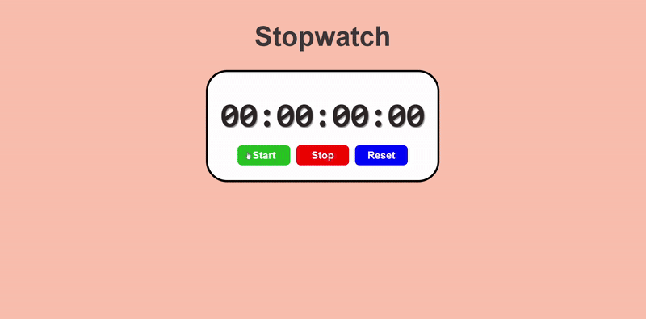

# ⏱️ Stopwatch Program

A simple and interactive stopwatch application built with HTML, CSS, and JavaScript!



## 📝 Description

This is a basic stopwatch program that allows users to:

- ▶️ **Start** the stopwatch timer
- ⏸️ **Stop** the stopwatch timer
- 🔄 **Reset** the stopwatch back to zero

The stopwatch displays time in HH:MM:SS:MS format (hours:minutes:seconds:milliseconds) with three interactive buttons below it. The interface features a clean, modern design with colorful buttons and hover effects for better user experience.

## 🚀 Features

- 🎯 **Simple Interface**: Clean and intuitive design
- 🎨 **Interactive Buttons**: Colorful buttons with hover effects
- ⚡ **Precise Timing**: Displays time down to milliseconds (10ms precision)
- 💫 **Smooth Design**: Modern styling with shadows and rounded corners
- 📱 **Cross-browser Compatible**: Works on all modern browsers

## 🛠️ Technologies Used

- **HTML5**: Structure and layout
- **CSS3**: Styling and animations
- **JavaScript**: Timer functionality and DOM manipulation

## 📁 Project Structure

```
Stopwatch program/
├── index.html      # Main HTML file
├── style.Css       # CSS styling
├── index.js        # JavaScript functionality
├── demo.gif        # Demo animation
└── README.md       # Project documentation
```

## 🎮 How to Use

1. Open `index.html` in your web browser
2. Click the **"Start"** button to begin the stopwatch
3. Click the **"Stop"** button to pause the stopwatch
4. Click the **"Reset"** button to set the timer back to 00:00:00:00

## 🎓 Learning Source

This project was created as part of learning JavaScript from:

**🌐 JavaScript Full Course for free (2024)** by **Bro Code**

📺 [Watch the tutorial here](https://www.youtube.com/watch?v=lfmg-EJ8gm4)

## 💡 What I Learned

- Working with `setInterval()` and `clearInterval()` for timing
- Date and time manipulation with `Date.now()`
- DOM manipulation with `getElementById()`
- Event handling with onclick events
- String formatting with `padStart()` method
- Managing application state with boolean variables

---

⭐ **Happy Coding!** ⭐
