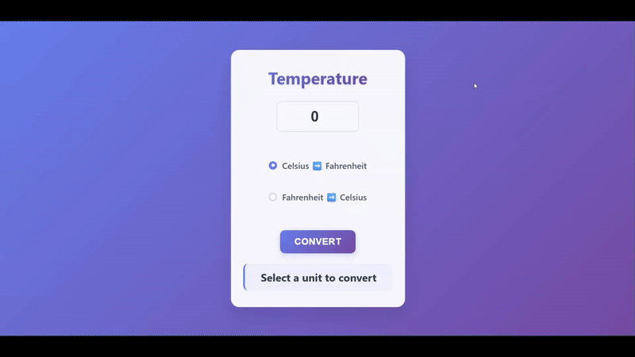

# 🌡️ Temperature Conversion Program

A simple and interactive temperature converter application built with HTML, CSS, and JavaScript!



## 📝 Description

This is a temperature conversion program that allows users to:

- 🔥 **Celsius to Fahrenheit**: Convert temperatures from Celsius to Fahrenheit
- ❄️ **Fahrenheit to Celsius**: Convert temperatures from Fahrenheit to Celsius
- 📊 **Real-time Results**: Instant conversion with precise decimal formatting

The converter features a beautiful gradient background with a modern glass-morphism design. Users simply enter a temperature value, select the conversion type using radio buttons, and click convert to see the result instantly.

## 🚀 Features

- 🎯 **Intuitive Interface**: Clean and modern glass-morphism design
- 🎨 **Responsive Design**: Works perfectly on desktop and mobile devices
- 💫 **Smooth Animations**: CSS transitions and hover effects for better UX
- 🔢 **Precise Calculations**: Results displayed with one decimal place accuracy
- ✨ **Interactive Elements**: Custom-styled radio buttons and form controls
- 🌈 **Gradient Backgrounds**: Beautiful color gradients throughout the interface

## 🛠️ Technologies Used

- **HTML5**: Structure and form layout
- **CSS3**: Modern styling with gradients, animations, and glass-morphism effects
- **JavaScript**: Temperature conversion logic and DOM manipulation

## 📁 Project Structure

```
Temperature conversion program/
├── index.html      # Main HTML file with form structure
├── style.css       # Advanced CSS styling with modern effects
├── script.js       # JavaScript conversion functionality
├── demo.gif        # Demo animation (if available)
└── README.md       # Project documentation
```

## 🎮 How to Use

1. Open `index.html` in your web browser
2. Enter a temperature value in the input field
3. Select your conversion type:
   - **Celsius ➡️ Fahrenheit**: Converts from Celsius to Fahrenheit
   - **Fahrenheit ➡️ Celsius**: Converts from Fahrenheit to Celsius
4. Click the **"Convert"** button to see the result
5. The converted temperature will appear below with precise formatting

## 🧮 Conversion Formulas

- **Celsius to Fahrenheit**: `°F = (°C × 9/5) + 32`
- **Fahrenheit to Celsius**: `°C = (°F - 32) × 5/9`

## 🎓 Learning Source

This project was created as part of learning JavaScript from:

**🌐 JavaScript Full Course for free (2024)** by **Bro Code**

📺 [Watch the tutorial here](https://www.youtube.com/watch?v=lfmg-EJ8gm4)

## 💡 What I Learned

- DOM manipulation and element selection with `getElementById()`
- Event handling with `onclick` events
- Working with radio buttons and form validation
- Number conversion and mathematical operations in JavaScript
- String formatting and `toFixed()` method for decimal precision
- Conditional statements (`if/else`) for different conversion types
- Modern CSS techniques including:
  - CSS gradients and backdrop filters
  - Glass-morphism design effects
  - Custom radio button styling
  - Responsive design principles

## 🎨 Design Features

- **Glass Morphism**: Semi-transparent background with backdrop blur
- **Gradient Backgrounds**: Beautiful color transitions
- **Custom Radio Buttons**: Styled radio inputs with smooth animations
- **Hover Effects**: Interactive feedback on all clickable elements
- **Mobile Responsive**: Optimized for all screen sizes

---

⭐ **Happy Converting!** ⭐
