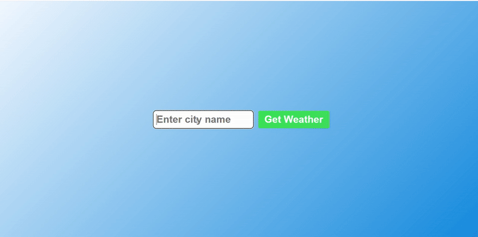

# 🌤️ Weather App Project

A beautiful and interactive weather application built with HTML, CSS, and JavaScript!



## 📝 Description

This is a comprehensive weather application that allows users to:

- 🌍 **Search Weather** by city name
- 🌡️ **View Temperature** in Fahrenheit with real-time data
- 💧 **Check Humidity** levels for any location
- 📄 **Read Weather Description** with detailed conditions
- 🎭 **See Weather Emojis** for visual weather representation
- ⚠️ **Error Handling** for invalid city names or network issues

The app features a modern gradient design with a clean card-based layout that displays weather information in an elegant and user-friendly manner.

## 🚀 Features

- 🎯 **Real-time Weather Data**: Fetches live weather information from OpenWeatherMap API
- 🎨 **Beautiful UI**: Modern gradient background with card-based design
- 📱 **Responsive Design**: Works seamlessly on all screen sizes
- 🌈 **Weather Emojis**: Visual representations for different weather conditions
- ❌ **Smart Error Handling**: User-friendly error messages for invalid inputs
- 🔄 **Dynamic Content**: Updates weather information without page reload
- 💫 **Smooth Animations**: CSS transitions for better user experience

## 🛠️ Technologies Used

- **HTML5**: Structure and semantic markup
- **CSS3**: Styling, gradients, and responsive design
- **JavaScript (ES6+)**: API integration and interactive functionality
- **OpenWeatherMap API**: Real-time weather data source

## 📁 Project Structure

```
Weather App project/
├── index.html      # Main HTML structure
├── style.css       # CSS styling and layout
├── script.js       # JavaScript functionality and API calls
├── demo.gif        # Demo animation
└── README.md       # Project documentation
```

## 🎮 How to Use

1. Open `index.html` in your web browser
2. Enter a **city name** in the input field
3. Click the **"Get Weather"** button
4. View the weather information displayed in the card:
   - 🏙️ City name
   - 🌡️ Current temperature
   - 💧 Humidity percentage
   - 📄 Weather description
   - 🎭 Weather emoji
5. Try different cities to explore weather around the world!

## 🌦️ Weather Conditions Supported

- ⛈️ **Thunderstorm** (200-299)
- 🌧️ **Drizzle & Rain** (300-599)
- ❄️ **Snow** (600-699)
- 🌫️ **Atmosphere** (700-799) - Fog, Mist, etc.
- ☀️ **Clear Sky** (800)
- ☁️ **Cloudy** (801-809)

## 🔑 API Setup

This project uses the OpenWeatherMap API. To use it:

1. Sign up at [OpenWeatherMap](https://openweathermap.org/api)
2. Get your free API key
3. Replace the API key in `script.js` with your own key

## 🎓 Learning Source

This project was created as part of learning JavaScript from:

**🌐 JavaScript Full Course for free (2024)** by **Bro Code**

📺 [Watch the tutorial here](https://www.youtube.com/watch?v=lfmg-EJ8gm4)

## 💡 What I Learned

- 🔗 **API Integration**: Making HTTP requests with fetch()
- 🔄 **Async/Await**: Handling asynchronous operations
- 🎯 **DOM Manipulation**: Dynamically updating HTML content
- 📝 **Form Handling**: Processing user input and form submissions
- 🎨 **CSS Gradients**: Creating beautiful background effects
- ❌ **Error Handling**: Managing API errors and user input validation
- 🧩 **Object Destructuring**: Extracting data from API responses
- 🎭 **Conditional Logic**: Displaying different emojis based on weather conditions

## 🚀 Future Enhancements

- 📍 **Geolocation**: Auto-detect user's current location
- 📊 **5-Day Forecast**: Extended weather predictions
- 🌡️ **Temperature Units**: Toggle between Celsius and Fahrenheit
- 🌙 **Dark Mode**: Theme switching capability
- 💾 **Local Storage**: Remember recent searches

---

⭐ **Happy Coding!** ⭐
